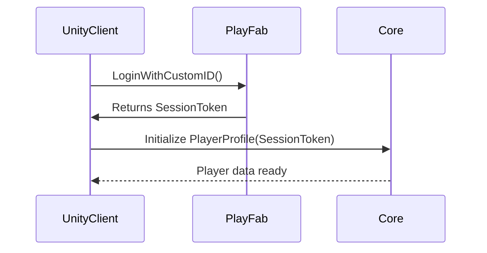

# Unity + PlayFab Game Architecture

## Overview

This project implements a **scalable, production-ready game architecture** that integrates **Unity** as the client and **PlayFab** as the backend service provider.  
It is designed with modularity, testability, and CI/CD automation in mind — enabling teams to build high-quality, maintainable online games efficiently.

---

## 🧩 Architecture Layers

```
project-root/
├── core/                # Engine-agnostic business logic and game systems
│   ├── domain/          # Core entities, models, and value objects
│   ├── usecase/         # Application logic and orchestration
│   └── infra/           # Adapters, repositories, and external gateways
│
├── client-unity/        # Unity game client (UI, scenes, networking)
│   ├── Assets/
│   ├── Scripts/
│   ├── Prefabs/
│   ├── Scenes/
│   └── Tests/
│
├── server-functions/    # PlayFab CloudScript and Azure Functions
│   ├── CloudScript/
│   └── SharedLib/
│
├── ops/                 # CI/CD pipelines, deployment scripts, configs
│   ├── ci/
│   ├── cd/
│   ├── docker/
│   └── monitoring/
│
└── docs/                # Documentation and onboarding guides
```

---

## 🔧 Design Philosophy

- **Clean Architecture** — Core logic isolated from frameworks and UI.
- **Testable Codebase** — Unit tests and integration tests supported.
- **Engine-Agnostic Core** — The `core/` layer can be reused outside Unity.
- **Cloud-Native Backend** — Serverless PlayFab/Azure functions for scale.
- **Continuous Delivery** — CI/CD integrated for fast iteration and safe deployment.

---

## 🚀 Onboarding

### Prerequisites

- Unity Editor 2022.3+  
- .NET 6 SDK  
- Node.js (for PlayFab CloudScript)  
- PlayFab Developer Account  
- Azure CLI (optional, for CI/CD ops)

### 1. Clone the Repository

```bash
git clone https://github.com/your-org/your-game-project.git
cd your-game-project
```

### 2. Initialize Submodules (if any)

```bash
git submodule update --init --recursive
```

### 3. Set up Unity Client

1. Open `client-unity/` in Unity Hub.  
2. Configure PlayFab settings under `Assets/Resources/PlayFabSettings.asset`.  
3. Run the first scene in `/Scenes/MainMenu.unity`.

### 4. Deploy Server Functions

```bash
cd server-functions/
npm install
npm run deploy
```

### 5. Configure CI/CD

CI/CD pipelines are located in `ops/ci` and `ops/cd`.  
They handle build, test, and deploy steps automatically.

---

## 🧠 Development Workflow

| Stage | Description | Tooling |
|-------|--------------|----------|
| Core Logic | Write and test engine-agnostic code | C++, C#, NUnit |
| Client | Implement UI, gameplay, and input systems | Unity Editor |
| Backend | Deploy CloudScript and server helpers | Node.js, PlayFab |
| Ops | Automate builds, tests, and deployments | GitHub Actions, Azure |

---

## 📁 Folder Details

### core/

Contains reusable business logic:
- `domain/`: defines entities like `Player`, `Inventory`, `MatchSession`
- `usecase/`: handles flows like login, matchmaking, item rewards
- `infra/`: provides persistence, PlayFab SDK wrappers, logging

### client-unity/

- Unity-specific integration of the `core/` layer.
- Uses dependency injection (Zenject or similar).
- Includes scripts for UI, scenes, network managers, etc.

### server-functions/

- Contains PlayFab CloudScript for custom server logic.
- Shared modules (`SharedLib/`) can be reused across multiple functions.

### ops/

- Docker, CI/CD YAMLs, monitoring configs (Grafana/Prometheus).
- Deploy pipelines for both Unity builds and PlayFab functions.

---

## 🧩 Example Flow: Player Login



---

## ⚙️ Tech Stack

| Component | Tech |
|------------|------|
| Client | Unity (C#) |
| Core Logic | C# (.NET Standard) |
| Backend | PlayFab, Node.js (CloudScript) |
| Infrastructure | Azure, GitHub Actions, Docker |
| CI/CD | GitHub Actions, PlayFab Automation |
| Testing | NUnit, Jest, PlayMode Tests |

---

## 📄 License

MIT License © 2025 Your Company

---

## 💬 Contributors

- **Lead Developer:** [Your Name]
- **Backend Engineer:** [Name]
- **Client Developer:** [Name]
- **DevOps:** [Name]

---

## 📘 Additional Resources

- [PlayFab Docs](https://learn.microsoft.com/en-us/gaming/playfab/)
- [Unity Manual](https://docs.unity3d.com/Manual/)
- [Azure Functions Guide](https://learn.microsoft.com/en-us/azure/azure-functions/)
