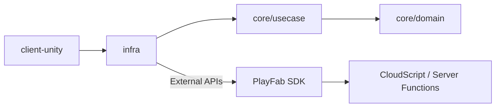

# 🏗️ PlayFab Systems — Architecture Overview

This document explains the full **architectural layout** of the PlayFab Systems repository.  
It is intended for developers contributing to core, infra, client, or server components.

---

## 🧩 Core Design Principles

The architecture follows **Clean Architecture** and **Domain-Driven Design (DDD)** principles.

### Goals

- **Independence**: Business logic (core) does not depend on Unity or any SDK.
- **Composability**: Each layer can be replaced or mocked easily.
- **Scalability**: Supports modular extension — e.g. adding new services like Photon or AWS.
- **Testability**: Core and infra can be unit tested independently.
- **Automation**: CI/CD ensures consistent builds, linting, and deployment.

---

## 🧱 Layer Overview

```
domain → usecase → infra → client
```

Each layer only depends on the layer to its left.  
`client` never contains business logic; `core` never references engine APIs.

---

## 🧠 Layer Breakdown

### 1️⃣ core/domain

Defines **entities** and **value objects** — the pure data and logic of the game world.

**Examples:**
- `Player`
- `Inventory`
- `Quest`
- `MatchResult`
- `Currency`

Each entity has methods and rules (e.g. `Player.AddItem()` validates ownership).

---

### 2️⃣ core/usecase

Implements **application logic** (interactors).  
These coordinate entities, handle input validation, and define the “verbs” of the system.

**Examples:**
- `LoginUseCase`
- `GrantRewardUseCase`
- `SyncInventoryUseCase`

Each usecase is typically constructed with one or more repositories (interfaces).

---

### 3️⃣ infra/

Implements the **repositories** and adapters that talk to the real world.  
Each corresponds to an interface defined in `core`.

**Examples:**
- `PlayFabAuthRepository`
- `PlayFabInventoryRepository`
- `CloudSaveRepository`
- `LocalCacheRepository`

They depend on SDKs (PlayFab, UnityWebRequest, etc.), never the other way around.

---

### 4️⃣ client-unity/

The presentation layer, containing:
- **Scenes & Prefabs**
- **Monobehaviours**
- **UI Scripts**
- **Bootstrap/Dependency Injection**

Responsibilities:
- Capture player input.
- Display results from core logic.
- Manage session, audio, and effects.

Recommended to use **Zenject (Extenject)** for dependency injection.

---

### 5️⃣ server-functions/

Contains backend logic for PlayFab CloudScript and external server integrations.

Each function:
- Wraps a `core` usecase or orchestrates infra services.
- Executes inside PlayFab’s serverless runtime.
- Should remain **stateless**.

**Example:**
```javascript
handlers.grantDailyReward = async function (args, context) {
  const playerId = context.playerProfile.PlayerId;
  const reward = await core.GrantRewardUseCase.execute(playerId);
  return { success: true, reward };
};
```

---

## 🧰 Cross-Cutting Concerns

### Dependency Injection
All services and repositories are injected at runtime.  
In Unity, this happens inside a `Bootstrap` MonoBehaviour or Zenject installer.

### Error Handling
Errors are represented as domain errors, not exceptions, in `core`.  
Infra converts them to user-facing messages when needed.

### Event System
Domain events are dispatched within `core` (e.g. `OnPlayerLevelUp`).  
The client or infra may subscribe and react (e.g. UI animation, cloud sync).

### Logging
All layers use the shared logging interface from `core/shared/logger`.

---

## 🔄 Data Flow Example

### Login Flow

```
[Unity Button → LoginPresenter] 
        ↓
[LoginUseCase.Execute()]
        ↓
[IAuthRepository.Login() → PlayFabAuthRepository]
        ↓
[PlayFab API → Response]
        ↓
[Domain Player Entity Updated]
        ↓
[UI Displays Logged-in State]
```

### Cloud Reward Flow

```
[PlayFab CloudScript Trigger]
        ↓
[ServerFunctionHandler → GrantRewardUseCase]
        ↓
[InventoryRepository → PlayFabInventory]
        ↓
[Response Sent Back to Client]
```

---

## ⚙️ Module Interaction Diagram



---

## 🧩 Folder Structure Recap

```
playfab-systems/
├── core/
│   ├── domain/
│   ├── usecase/
│   └── shared/
├── infra/
│   ├── playfab/
│   ├── storage/
│   └── analytics/
├── client-unity/
│   ├── scripts/
│   ├── ui/
│   └── bootstrap/
├── server-functions/
│   ├── functions/
│   └── shared/
└── ops/
    ├── github/
    ├── docker/
    └── scripts/
```

---

## 📦 Technology Stack by Layer

| Layer | Language | Framework | Example |
|-------|-----------|------------|----------|
| core | C# | None | Domain logic |
| infra | C# | PlayFab SDK | API Adapters |
| client-unity | C# | Unity (2022+) | Gameplay & UI |
| server-functions | JS/TS | PlayFab CloudScript | Backend logic |
| ops | YAML / Bash | GitHub Actions / Docker | CI/CD |

---

## 🚀 Scalability Roadmap

| Phase | Focus | Description |
|-------|--------|-------------|
| **Phase A** | Foundation | Establish clean architecture & login flow |
| **Phase B** | Cloud | Add serverless functions, inventory sync |
| **Phase C** | Multiplayer | Integrate matchmaking (Photon/FishNet) |
| **Phase D** | Analytics | Add data telemetry and A/B testing |
| **Phase E** | Automation | Full CI/CD pipeline, versioning, docs |

---

## 🧭 Summary

PlayFab Systems is designed for **long-term scalability** and **cross-platform development**.  
Each layer is autonomous, replaceable, and testable. By adhering to the clean architectural pattern, teams can extend functionality without breaking existing systems.

